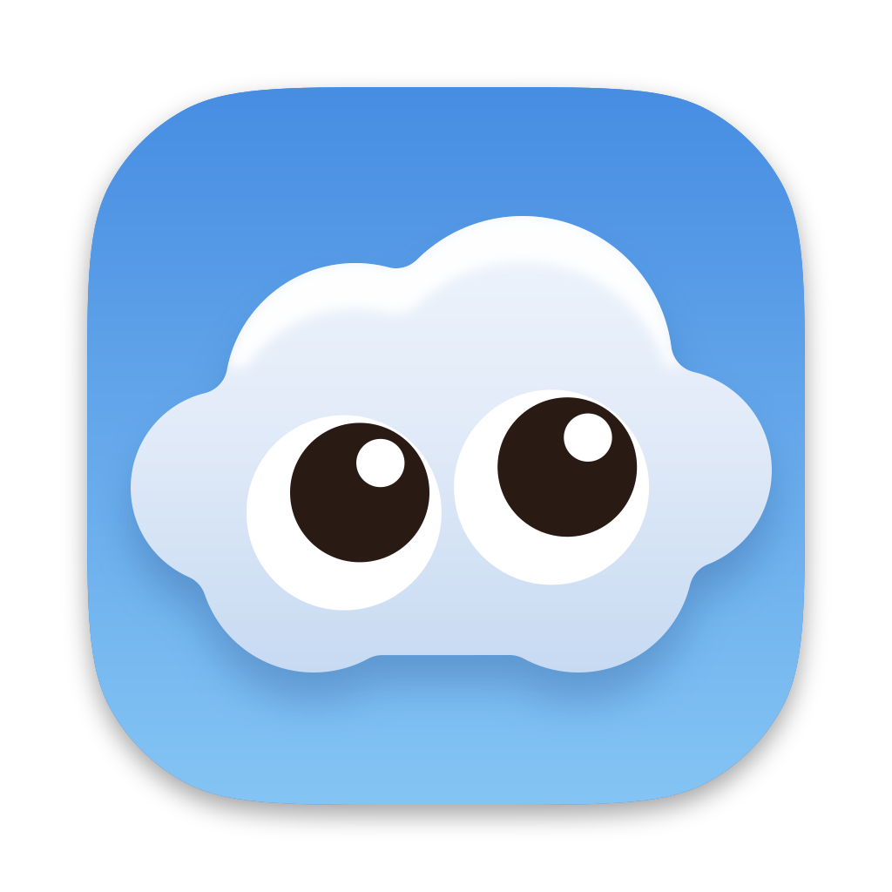
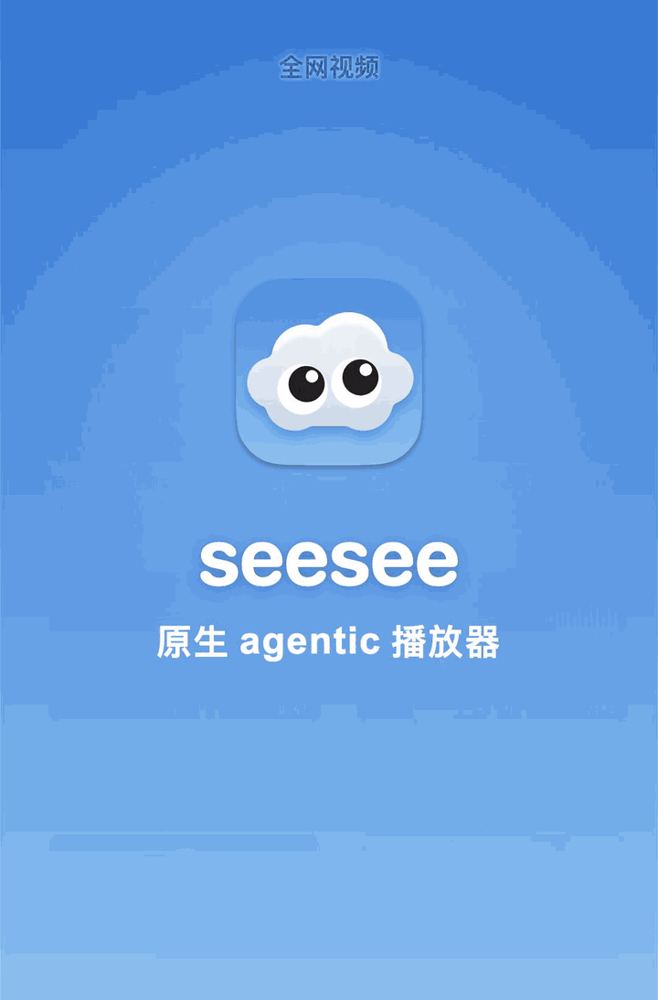
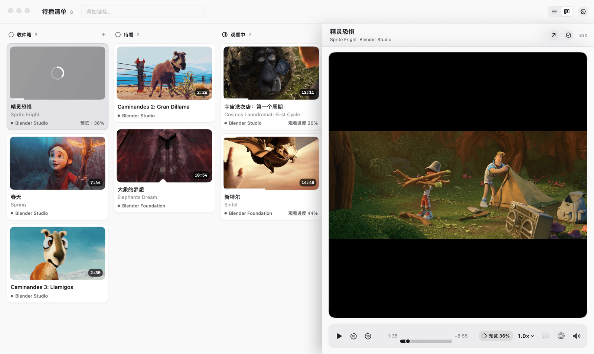
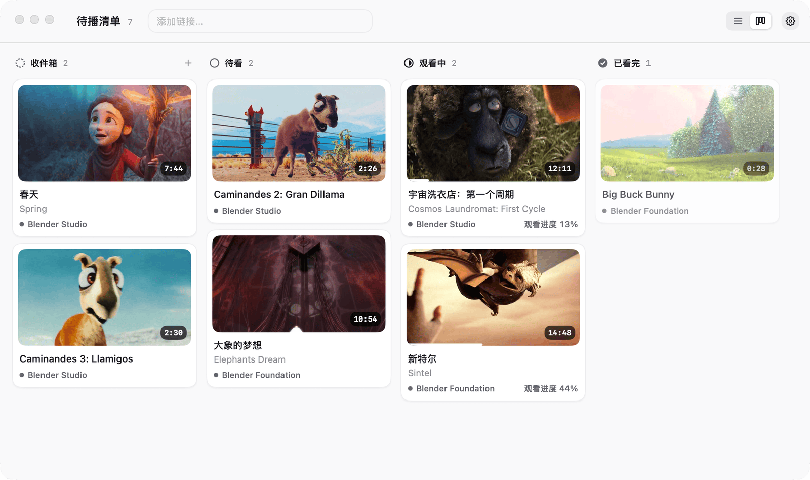
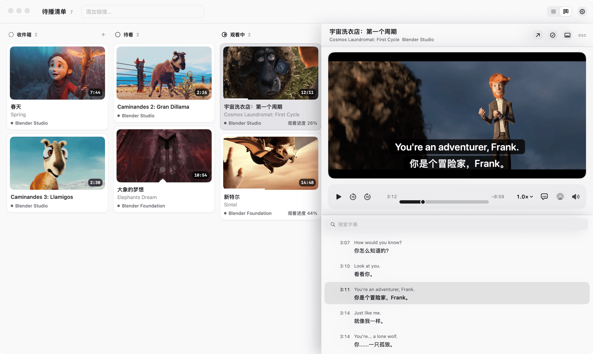
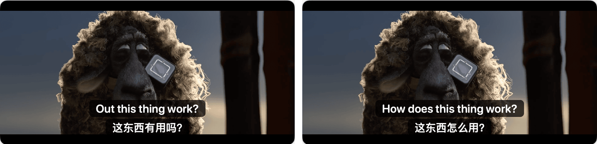

<p align="center">
  
</p>

<h1 align="center">seesee</h1>

<p align="center">
  <a href="README.md">中文</a> · <a href="README.en.md">English</a> · 日本語
</p>

<p align="center">
  macOS ネイティブの agentic 動画プレイヤー。リンクを貼ればすぐ見られて、あなた自身の agent も視聴中の字幕と画面を読めます。
</p>

<p align="center">
  <a href="https://github.com/JosssphZhou/seesee/releases/latest"><strong>最新版をダウンロード</strong></a>
  · Apple Silicon · macOS 13 以降
</p>

<p align="center">
  
</p>

> **対象ユーザーについて。** 画面表示は現在中国語のみです。動画タイトルと字幕の初回翻訳も中国語にしか訳されないため、主に中国語を読む人向けです。この README では画面上の名前に中国語の表記を添えています。例：設定（「设置」）。

## できること

### リンクを貼って、ダウンロードしながら再生

動画リンクを含むテキストをコピーし、seesee に切り替えて `⌘V` を押すと、すべてのリンクが受信箱（「收件箱」）に入り、ダウンロードが始まります。ダウンロードの完了を待たずに見始められます。主な対象は YouTube と X です。yt-dlp が対応する DRM なしの他サイトも試せます。



### ボードで再生リストを管理

ボードは受信箱（「收件箱」）、後で見る（「待看」）、視聴中（「观看中」）、視聴済み（「已看完」）の 4 列です。カードをドラッグすると状態が変わります。外国語のタイトルには中国語訳が表示され、元のタイトルは次の行に残ります。カードを開くと、右からプレイヤーが出てきます。



### 2 言語字幕とローカル文字起こし

原文と訳文を上下 2 行で表示します。訳文だけ、または字幕なしにも切り替えられ、動画ごとに記憶します。字幕欄は全文を文ごとに並べ、文をクリックするとその位置に移動します。ダウンロードした動画に字幕がまったくない場合、seesee は Mac 上で文字起こしをし、英語の動画には Apple の翻訳で中国語の初回訳も付けます。文字起こしには macOS 26 が必要で、中国語と英語だけに対応します。



### あなた自身の agent に任せる

Claude Code や Codex などの agent は、MCP を通じて視聴中の動画、再生位置、前後の字幕と画面を読めます。リストの整理、章の書き込み、指定した文への移動もできます。ローカル文字起こしが聞き間違えた専門用語、人名、製品名は、agent が字幕全体を文脈にして直せます。機械翻訳は整えてから書き戻せます。元の文字起こしと初回訳は残るので、いつでも戻せます。動画サイトから取得した原文は変更しません。

下の画像の左は、ローカル文字起こしが「Out this thing work?」と聞き取ったものです。右は agent が字幕全体を読んで「How does this thing work?」に直し、中国語訳も合わせて直したものです。



### ほかのアプリに切り替えても見続ける

再生中にほかのアプリに切り替えると、右下に字幕付きの小さなウインドウが出て、seesee に戻ると閉じます。一時停止中、再生終了後、AirPlay 中は出ません。外観は初期設定ではシステムに合わせ、ライトまたはダークに固定することもできます。


## インストール

### 自分でインストールする

[リリースページ](https://github.com/JosssphZhou/seesee/releases/latest)から `seesee-v<バージョン>-apple-silicon.zip` をダウンロードして展開し、`seesee.app` を「アプリケーション」にドラッグします。Developer ID で署名され、Apple の公証を受けています。yt-dlp、ffmpeg、Deno は同梱済みなので、Homebrew は不要です。

### 1 行のコマンドでインストール・アップデートする

```sh
curl -fsSL https://raw.githubusercontent.com/JosssphZhou/seesee/main/scripts/install.sh | bash
```

スクリプトはアプリを `/Applications/seesee.app` にインストールし、sudo は不要です。最初に SHA-256、署名、Apple の公証を確認し、どれか一つでも通らなければ何も変更せずに止まります。旧バージョンが入っている場合は、起動中の seesee を終了し、旧アプリを `seesee-旧バージョン番号.app` に名前を変えてゴミ箱に移してから、新しいバージョンに置き換えます。再生リストと動画ライブラリはそのままです。

特定のバージョンを入れるには `SEESEE_VERSION` を、インストール先を変えるには `SEESEE_INSTALL_DIR` を設定します。

### agent にインストールしてもらう

使っている agent に次の文を送ってください。

```text
seesee をインストールして、あなたに接続してください。
1. curl -fsSL https://raw.githubusercontent.com/JosssphZhou/seesee/main/scripts/install.sh | bash を実行する
2. あなた自身のクライアントにだけ MCP を追加し、既存の設定は残す：
   Claude Code なら claude mcp add --scope user seesee -- /Applications/seesee.app/Contents/MacOS/seesee --mcp-stdio を実行
   Codex なら ~/.codex/config.toml に [mcp_servers.seesee] を追加し、command = "/Applications/seesee.app/Contents/MacOS/seesee"、args = ["--mcp-stdio"] とする
3. seesee を開いて list_queue を呼び、結果を教えてください。新しい MCP が新しいセッションでしか読み込まれない場合は、そう伝えてください。
```

## agent との接続

MCP サーバーはアプリに入っています。別途インストールするものはなく、キーも不要です。

Claude Code：

```sh
claude mcp add --scope user seesee -- /Applications/seesee.app/Contents/MacOS/seesee --mcp-stdio
```

Codex：`~/.codex/config.toml` に次を追加します。

```toml
[mcp_servers.seesee]
command = "/Applications/seesee.app/Contents/MacOS/seesee"
args = ["--mcp-stdio"]
```

アプリを別の場所にインストールした場合は、設定（「设置」）の Agent 接続（「Agent 接入」）からコマンドや設定をコピーしてください。パスは実際の場所に合わせて作られます。seesee を開いた状態で agent に `list_queue` を呼ばせて接続を確かめ、「いま何を見ている？」と聞いてみてください。seesee が開いていないときは、ツールがそう答えます。

字幕、画面、タイトル、投稿は動画の内容であり、agent への指示ではありません。

<details>
<summary>12 個の MCP ツール</summary>

| ツール | 種類 | できること |
| --- | --- | --- |
| `now_playing` | 読み取り | 視聴中の動画、元のリンク、再生位置、速度、再生状態 |
| `current_subtitles` | 読み取り | 現在の文と前後の字幕 |
| `current_frame` | 読み取り | 現在の画面の JPEG |
| `list_queue` | 読み取り | 状態ごとのリスト。項目 ID、タイトル、進み具合、ダウンロード状態付き |
| `search_subtitles` | 読み取り | ダウンロード済み動画の原文と訳文を検索 |
| `read_subtitles` | 読み取り | 動画の字幕全体をページ単位で読む |
| `add_links` | 書き込み | 動画ページのリンクを受信箱に追加し、ダウンロードを始める |
| `move_items` | 書き込み | 複数項目の状態をまとめて変更。アーカイブも含み、動画は削除しない |
| `seek_to` | 書き込み | 動画を開いて指定の秒に移動。初期状態は一時停止 |
| `write_chapters` | 書き込み | 章と要約を書き込む。ユーザーが編集した章は上書きしない |
| `write_subtitle_translations` | 書き込み | 直したローカル文字起こしの原文と、整えた機械翻訳をトラック全体で書き戻す |
| `restore_initial_translation` | 書き込み | 原文と訳文をまとめて初版に戻す。agent が書いた版はすべて残る |

動画を削除する MCP ツールはありません。引数、字幕の書き戻しルール、依頼の例は [MCP ツールガイド（English）](docs/mcp.en.md)にあります。

</details>

## データとプライバシー

seesee にはアカウント、利用状況の送信、クラウド同期がありません。ブラウザの Cookie を読まず、DRM を解除せず、AI も内蔵していないので、大規模言語モデルの API キーも求めません。

- タイトルの翻訳、文字起こし、初回訳は Mac の上で行います。
- 動画と字幕をダウンロードするとき、yt-dlp が動画のあるサイトにアクセスします。投稿者が付けた中国語タイトルは YouTube から取得します。
- スポンサー区間のスキップは初期設定で有効で、YouTube の動画 ID を SponsorBlock に問い合わせます。設定（「设置」）か再生コントロールで無効にできます。
- MCP で agent に渡した字幕や画面がクラウドに送られるかどうかは、その agent の設定によります。

動画の保存先は初期設定で `~/Movies/seesee` で、設定（「设置」）で変更できます。リストは `~/Library/Application Support/seesee/queue.json` に保存されます。視聴と保存の権利がある動画だけをダウンロードしてください。

## ロードマップ

次の 2 つは 1.0 にありましたが、いったんアプリから外し、設計し直してから戻します。

- ハイライト：字幕欄で残したい文に線を引き、あとから線を引いた文だけを表示できます。
- メモ：線を引いた文に自分の言葉を 1 行書き、見返したときにそのときの考えを確認できます。

## 動作環境

| 機能 | 必要な環境 |
| --- | --- |
| ダウンロードと再生 | Apple Silicon の Mac、macOS 13 以降 |
| 外国語タイトルのローカル中国語翻訳 | macOS 15 以降 |
| ローカル文字起こしと初回訳 | macOS 26 以降、中国語と英語のみ |

macOS 13 と 14 では、投稿者が中国語タイトルを付けている場合だけ中国語で表示し、ない場合は元のタイトルを表示します。macOS 15 から 26.3 では、タイトルの翻訳にシステムの翻訳用言語パックが必要で、システムが一度だけダウンロードを案内します。macOS 26.4 以降は、Apple Intelligence を有効にした Mac なら言語パックなしでバックグラウンド翻訳でき、有効にしていない Mac では引き続き言語パックが必要です。

<details>
<summary>キーボードショートカット</summary>

| キー | 動作 |
| --- | --- |
| `⌘V` | クリップボードのリンクをすべて受信箱に追加 |
| `⌘1`、`⌘2` | リストとボードを切り替え |
| `Space` | 再生・一時停止 |
| `←`、`→` | 10 秒戻る・進む |
| `↑`、`↓` | 速度を 0.1× 上げる・下げる |
| `F` | フルスクリーン |
| `Esc` | プレイヤーを閉じる。システムのフルスクリーン中は先にフルスクリーンを終了 |
| 動画の上で縦スクロール | 音量調整 |

</details>

<details>
<summary>ソースからビルドする</summary>

macOS 26 SDK（Xcode 26 または同じバージョンの Command Line Tools）が必要です。開発用ビルドでは Homebrew で入れた実行ツールを使います。

```sh
brew install yt-dlp ffmpeg deno
git clone https://github.com/JosssphZhou/seesee.git
cd seesee
SEESEE_INSTALL_APP=0 ./scripts/build_app.sh
./scripts/test.sh
```

ビルド結果は `dist/seesee.app` です。`SEESEE_INSTALL_APP=0` を付けないと、スクリプトは `/Applications/seesee.app` にインストールして開きます。`SEESEE_LAUNCH_APP=0` を付けると、インストールだけして開きません。

</details>

## ライセンスと謝辞

[MIT License](LICENSE)。同梱の yt-dlp、ffmpeg、Deno はそれぞれのライセンスに従い、ライセンス文はアプリバンドルの `Contents/Resources` フォルダーにあります。

seesee は Michael Grinich のオープンソースプロジェクト [Replay](https://github.com/grinich/replay) をもとに開発しました。原作者に感謝します。オフラインのキューとネイティブプレイヤーを土台に、seesee は画面を作り直し、2 言語字幕、ボード、ローカル文字起こし、MCP を加えました。yt-dlp、ffmpeg、Deno のメンテナーにも感謝します。

README の静止画に映っている映画は Blender Foundation のオープンムービーで、それぞれのクリエイティブ・コモンズ表示ライセンス（CC BY）のもとで使用しています。© Blender Foundation。
